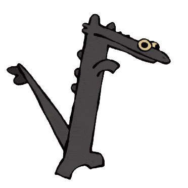

Coordinate-Consistent Localization via Continuous-Time Calibration and Fusion of UWB and SLAM Observations
===
The details of slam-uwb-calibration are presented in this conference papers. Please cite these works if you find slam-uwb-calibration useful:

```
@inproceedings{nguyen2025slam-uwb-calibration,
  title         = {Coordinate-Consistent Localization via Continuous-Time Calibration and Fusion of UWB and SLAM Observations},
  author        = {Nguyen, Tien-Dat and Nguyen, Thien-Minh and Nguyen, Vinh-Hao},
  booktitle     = {The 2025 International Symposium on Electrical and Electronics Engineering (ISEE 2025)}
  pages         = {1--6},
  year          = {2025},
  organization  = {DEE-HCMUT}
}
```
[arXiv](https://arxiv.org/abs/2510.05992)


And this work is tested with [NTU VIRAL](https://ntu-aris.github.io/ntu_viral_dataset/) dataset. If you need **the estimated positions of the UWB anchors** for the dataset, you can find them at the end.
<!-- ```
@article{nguyen2022ntu,
  title     = {NTU VIRAL: A Visual-Inertial-Ranging-Lidar Dataset, From an Aerial Vehicle Viewpoint},
  author    = {Nguyen, Thien-Minh and Yuan, Shenghai and Cao, Muqing and Lyu, Yang and Nguyen, Thien Hoang and Xie, Lihua},
  journal   = {The International Journal of Robotics Research},
  volume    = {41},
  number    = {3},
  pages     = {270--280},
  year      = {2022},
  publisher = {SAGE Publications Sage UK: London, England}
}
``` -->

Finally, we use [SLICT](https://github.com/brytsknguyen/slict) as the SLAM backend in this work.
<!-- 
```
@article{nguyen2023slict,
  title         = {SLICT: Multi-input Multi-scale Surfel-Based Lidar-Inertial Continuous-Time Odometry and Mapping},
  author        = {Nguyen, Thien-Minh and Duberg, Daniel and Jensfelt, Patric and Yuan, Shenghai and Xie, Lihua},
  journal       = {IEEE Robotics and Automation Letters},
  volume        = {8},
  number        = {4},
  pages         = {2102--2109},
  year          = {2023},
  publisher     = {IEEE}
}
```

```
@article{nguyen2024eigen,
  title         = {Eigen Is All You Need: Efficient Lidar-Inertial Continuous-Time Odometry With Internal Association}, 
  author        = {Nguyen, Thien-Minh and Xu, Xinhang and Jin, Tongxing and Yang, Yizhuo and Li, Jianping and Yuan, Shenghai and Xie, Lihua},
  journal       = {IEEE Robotics and Automation Letters}, 
  year          = {2024},
  volume        = {9},
  number        = {6},
  pages         = {5330-5337},
  doi={10.1109/LRA.2024.3391049}
}
``` -->


## Prerequisites

The software was developed on the following dependencies. Ubuntu 20.04 and ROS Noetic is a must for compiling.

- [Ubuntu 20.04](https://releases.ubuntu.com/20.04/) with [ROS Noetic](http://wiki.ros.org/noetic/Installation)

- [Ceres 2.1.0](http://ceres-solver.org/installation.html) (or older, if you use later versions you may encounter [this error](https://github.com/brytsknguyen/slict/issues/2#issuecomment-1431686045))

    ```bash
    git clone https://ceres-solver.googlesource.com/ceres-solver
    cd ceres-solver && git fetch --all --tags
    git checkout tags/2.1.0
    mkdir build && cd build
    cmake .. && make -j$(nproc)
    sudo make install
    ```
- PCL, Eigen3, glog
    ```bash
    sudo apt install libpcl-dev
    sudo apt install libeigen3-dev
    sudo apt install libgoogle-glog-dev
    ```
## Installation

slam-uwb-calib is tested with the NTU VIRAL dataset, so the UWB message driver package is required.
In the workspace, you will need:
1. [slam-uwb-calibration](https://github.com/ntdathp/slam-uwb-calibration) 
2. [uwb-driver](https://github.com/ntu-aris/uwb_driver)


Please install all dependencies first. Afterwards, create a ros workspace, clone the packages to the workspace, and build by `catkin build` or `catkin_make`, for e.g.:

```
mkdir -p catkin_ws/src
cd catkin_ws/src
git clone https://github.com/ntu-aris/uwb_driver
git clone https://github.com/ntdathp/slam-uwb-calibration
cd .. && catkin build
```
The launch files for NTU VIRAL are provided under `launch`

## Data
The UWB raw data from **NTU VIRAL** and the resulting odometry outputs of **SLICT** are provided in CSV format under the `data` directory for convenience.

<p align="left">
  
</p>

## Estimated UWB Anchor Positions

> **Note:** The anchor positions below are expressed in the **local SLAM coordinate frame of sequence 01**.  
> If you need the positions for other sequences (e.g., 02, 03), you can run the calibration process yourself.


<p align="left">
  
</p>

| Dataset | Anchor | X        | Y        | Z        |
|---------|--------|----------|----------|----------|
| eee     | 100    | -3.68286 | -28.7447 | 1.39796  |
|         | 101    | -2.96737 | 12.8093  | 0.824449 |
|         | 102    | 9.82079  | -5.19915 | 1.39119  |
| nya     | 100    | 5.86269  | -3.60289 | 1.35334  |
|         | 101    | -8.43474 | -1.66775 | 1.11005  |
|         | 102    | 2.44084  | 8.71578  | 1.22421  |
| rtp     | 100    | 1.73917  | 29.7529  | 1.70336  |
|         | 101    | 1.09405  | -13.6562 | 1.13523  |
|         | 102    | -7.89696 | 12.5038  | 1.05457  |
| sbs     | 100    | 8.1662   | 20.1319  | 1.17302  |
|         | 101    | 10.8843  | -11.0781 | 1.25683  |
|         | 102    | -10.2494 | 4.04065  | 0.934634 |
| spms    | 100    | -22.1122 | 10.8926  | 1.74106  |
|         | 101    | 14.7838  | 11.0093  | 1.9919   |
|         | 102    | -2.46569 | -2.91135 | 1.46608  |
| tnp     | 100    | 5.28293  | 15.7959  | 1.14378  |
|         | 101    | 6.92472  | -11.6143 | 1.01097  |
|         | 102    | -4.8906  | 0.806349 | 0.95558  |

